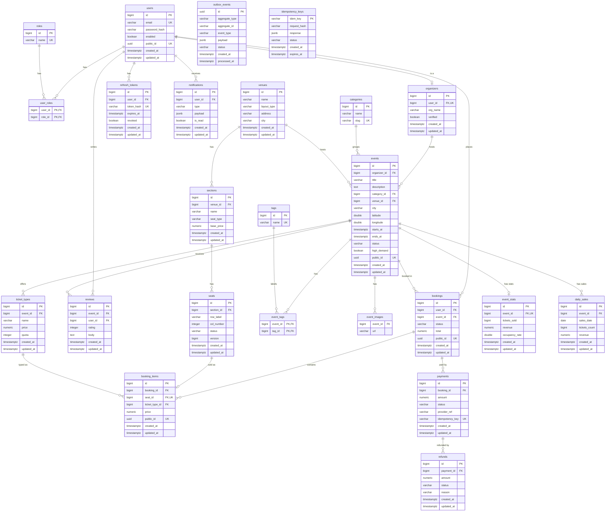

# EventHub — Entity Relationship Diagram

> Source of truth: Flyway migrations `V1`–`V4`. Mirrors the Postgres/Neon
> schema and the JPA entities under `org.istiaqfuad.eventhub.*`.
> Link tables `user_roles` / `event_tags` map to `@ManyToMany`;
> `event_images` maps to `@ElementCollection`.

## Composite / multi-column constraints

Not expressible in Mermaid attribute markers, but present in the schema:

- `seats` — `UNIQUE (section_id, row_label, col_number)`
- `booking_items` — `UNIQUE (seat_id)` (nullable → general-admission rows skip it); `CHECK (seat_id IS NOT NULL OR ticket_type_id IS NOT NULL)`
- `reviews` — `UNIQUE (event_id, user_id)` (V4)
- `daily_sales` — `UNIQUE (event_id, sales_date)`
- `user_roles` / `event_tags` — composite primary key (both FK columns)

## Standalone tables (reliability layer)

`outbox_events`, `idempotency_keys` — intentionally have no FKs to domain tables
(transactional outbox + idempotency dedup).

## Keeping this in sync

- **On schema change:** add a Flyway `V{n}` migration, then edit this file to
  match. `git diff` shows the delta — this file is the version-controlled sync
  record.
- **Live (auto-sync) diagrams in IntelliJ:**
  - Datasource ERD — Database tool → right-click schema → **Diagrams → Show
    Visualization** (`Ctrl+Alt+Shift+U`). Reflects the live Neon schema.
  - Entity ERD — **Persistence** tool window → right-click persistence unit →
    **Entity Relationship Diagram**. Reflects the `@Entity` classes.
